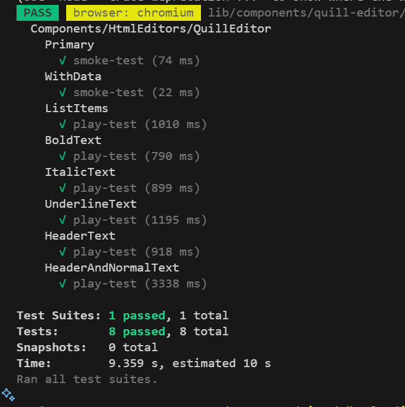
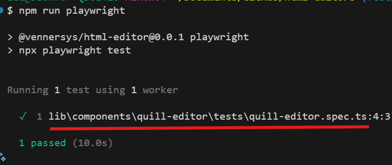
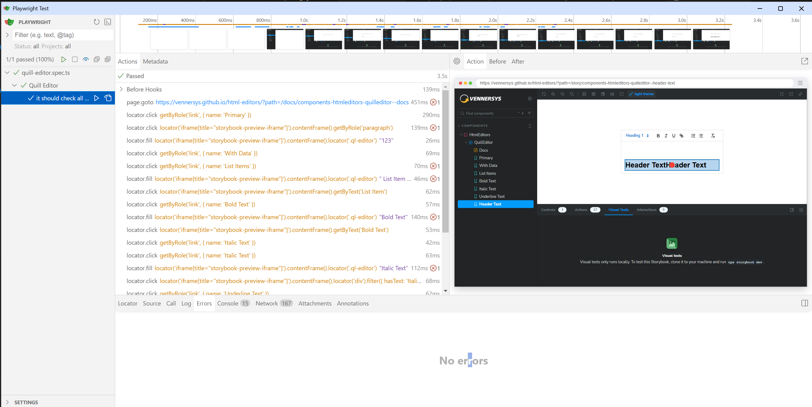
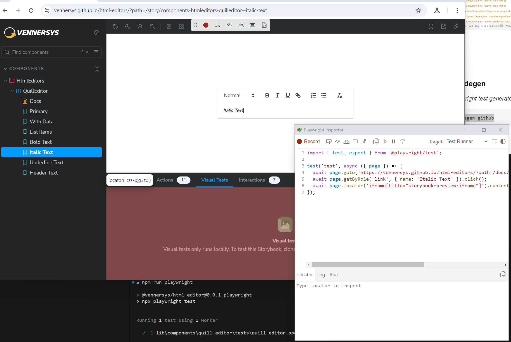
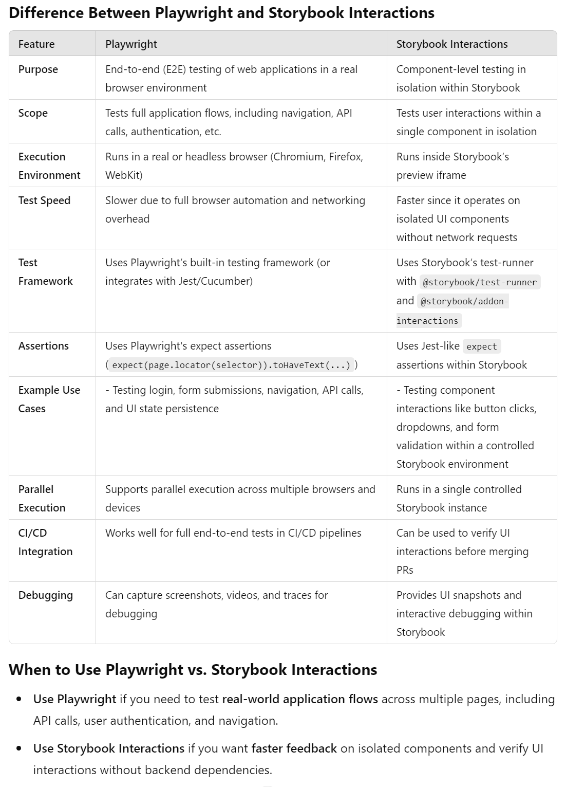

# @vennersys/html-editors

Repository to simply demo different html editors

[Public Storybook](https://vennersys.github.io/html-editors)

## Getting Started

### Install packages

```shell
npm i
```
### Storybook
Storybook can be used for manual component testing, or terminal testing of a hosted Storybook page. The tests are isolated to a story level.

#### Run Storybook

```shell
npm run storybook
```

#### Test Storybook (local)
*Your Storybook needs to be running in a separate terminal before running this (`npm run storybook`)*

```shell
npm run test-storybook
```

A distinction can be made between smoke tests, and tests that actually have interactions.


#### Test Storybook (github)
*This will test the [currently deployed](https://vennersys.github.io/html-editors) instance of Storybook from the terminal*

```shell
npm run test-storybook-github
```

### Playwright
Playwright can record multiple steps for interactions with any website, and is better for e2e tests

#### Run Playwright

```shell
npm run playwright
```



#### Run Playwright Headed
*This will launcher a chromium browser*

```shell
npm run playwright-headed
```

#### Run Playwright Headed
*This will launcher a chromium browser*

```shell
npm run playwright-ui
```



#### Run Playwright Codegen
*This will launch the playwright test generator tool*

```shell
npm run playwright-codegen-github
```




